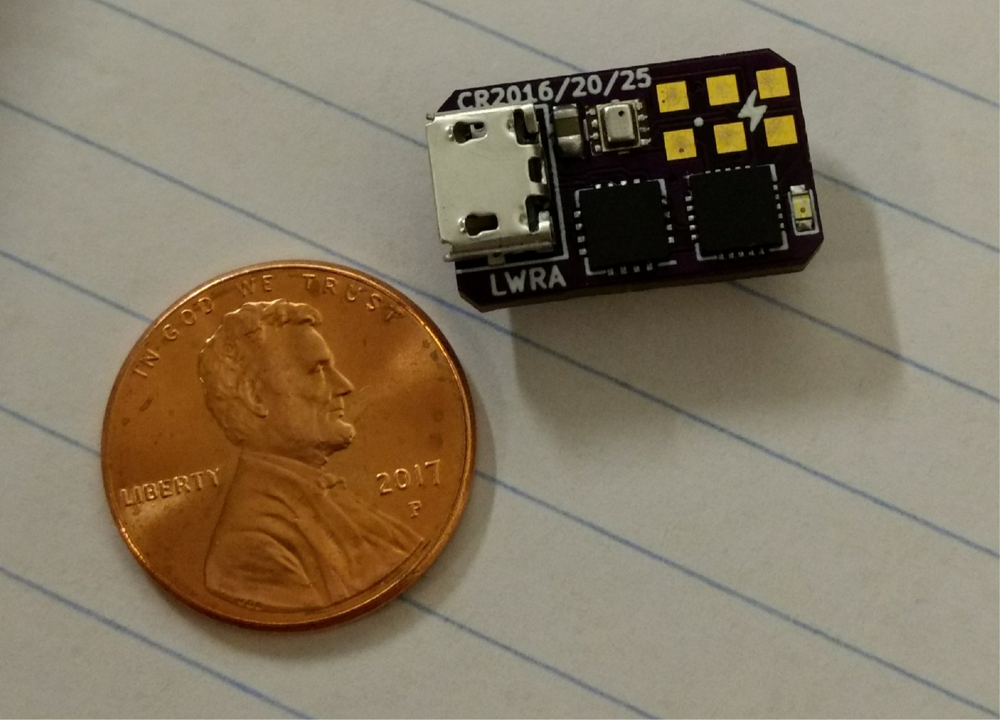
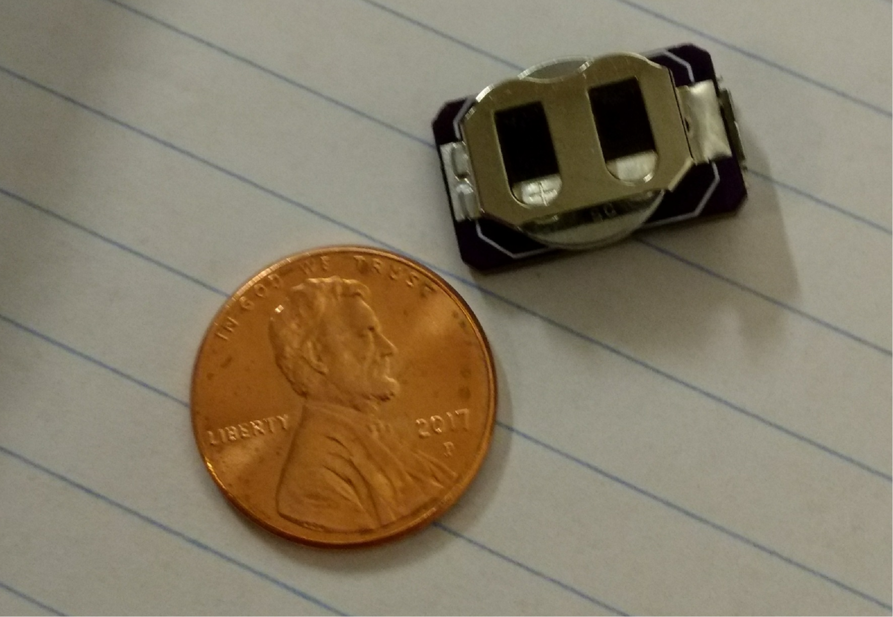

# About #

The Light Weight Rocket Altimeter (LWRA) is a an attempt at the simplest and lightest
rocket altimeter on the market. A lightweight altimeter can see use in altitude competitions
such as the Team America Rocketry Challenge (TARC) and FAI competitions where weight and space
for an altimeter in a rocket is at a premium. Recent versions include built in data logging without
an external dongle or tool.

| Front | Back |
| ---------------------------------------------- | --------------------------------------------- |
|   |   |

# Hardware History #

## Current Version ##
## REV I ##
- Current version
- Uses the ATTiny841 with the FT230X to interface with the computer
- Same form factor and battery as REV H
- Battery connector offers a point to tether the altimiter inside the rocket
- Uses the CR1216, CR1220, or CR1225 batteries which are easy to replace
- Size was less of a concern on this version allowing user interface and cost to be the main concern

## Previous Versions ##
## REV A ##
- First design used ATTiny85 and MPL3115A2 pressure sensor
- The wrong pins were used to interface with the sensor
- Used a CR1216 coin cell battery
## REV B ##
- Used the ATTiny841 with the BMP280 pressure sensor for its reduced cost
- Included an FT230X USB to serial adapter to interface with the computer
- Had a small 5.8mAh 3V battery on the back of the PCB
- Battery life was limited and lacked a proper battery charging circuit. 
- The ATTiny841 only supports I2C slave and not master functionallity that was needed to interace with the BMP280
## REV C ##
- Used the ATmegaXXU2 series microcontrollers.
- HWB pin on the MCU was not connected to GND so it wasn't possible to program the MCU
- Used a 1.5V button cell with boost regulator, however the battery couldn't provide enough current
## REV D ##
- Fixed the HWB pin issue
## REV E ##
- Moved back to the ATTiny841 because of issues with LUFA
- Used same battery and regulator circuit as REV D
- UART adapter was external from the board therefore requiring a dongle
- Misc. pinout issues
## REV F ##
- Same as REV E with updated pinout on ICSP connector
## REV G ##
- Updated version of REV D with mounting hole
## REV H ##
- Moved to same form factor as REV A for easier use and reduced BOM cost
- Still used ATmegaXXU2 series MCUs
- CR1216 and CR1220 couldn't supply a high enough voltage under load to prevent the MCU from brown out

